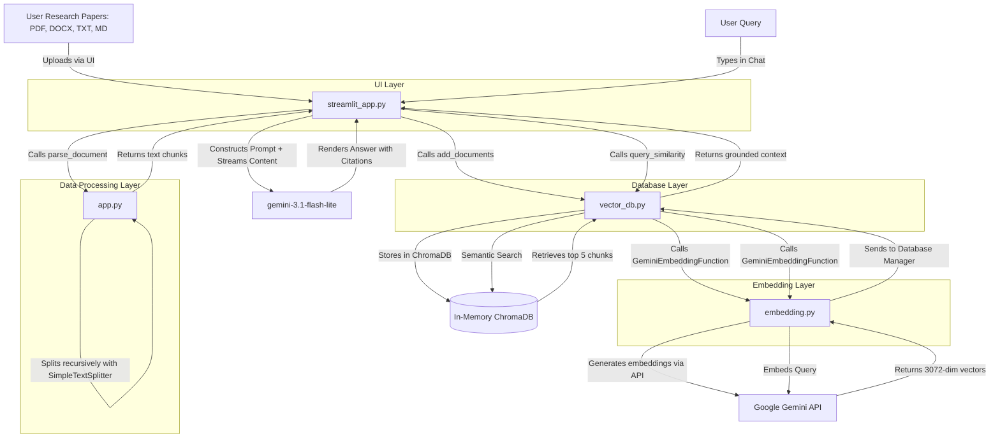

# RAG-Based Research Assistant (Gemini & ChromaDB)

A premium, browser-hosted **Retrieval-Augmented Generation (RAG)** Research Assistant built from scratch using the modern **Google GenAI SDK** (`google-genai`), **ChromaDB**, and **Streamlit**. 

Designed specifically for serverless/online environments (e.g., Streamlit Community Cloud) with a modular architecture and in-memory database configuration.

---

## 🏗️ Architectural Overview & Workflow

The application is split into four distinct layers (Separation of Concerns) to make it clean, future-proof, and maintainable.



---

## 🛠️ Tech Stack & Model Specs

*   **Large Language Model (LLM):** `gemini-3.1-flash-lite` (Default)
    *   Optimized for high-speed streaming chat responses and grounded QA.
*   **Text Embedding Model:** `gemini-embedding-2` (Output Dimension: 3072)
    *   Generates rich vector representations of academic papers.
*   **Vector Database:** `ChromaDB` (In-Memory `EphemeralClient` setup)
    *   Self-contained, in-process database that spins up instantly and requires zero external database server setup (perfect for Streamlit Cloud).
*   **Frontend UI Framework:** `Streamlit`
    *   Curated dark mode theme with glassmorphic cards, custom flex-styled chat bubbles, and responsive tabs.

---

## 📁 Project Directory Structure

```text
├── app.py              # Backend RAG logic: File parsing (.pdf, .docx, .txt, .md) and text chunking
├── embedding.py        # Custom embedding function wrapping google-genai and concurrent threads
├── vector_db.py        # ChromaDB setup, collection operations, similarity search, and document retrieval
├── streamlit_app.py    # Main UI layout, chat interface, metric displays, and session state management
├── requirements.txt    # Python dependencies
└── README.md           # Documentation
```

---

## 🚀 Key Features (What it does now)

1.  **💬 Research Chat Tab:**
    *   Perform interactive grounded QA against all uploaded documents.
    *   Streams replies in real-time.
    *   Provides clickable, highlighted citation tags specifying the source document and page number.
2.  **📄 Document Summarizer Tab:**
    *   Select any uploaded document and generate a structured executive summary containing **Objective**, **Methodology**, **Key Findings**, and **Significance/Limitations**.
3.  **📊 Key Insights & Q&A Tab:**
    *   Automatically extracts core scientific concepts/definitions, key takeaways, and generates advanced discussion questions across your entire document repository.
4.  **⚙️ Ingestion & Sidebar Management:**
    *   Upload multiple files concurrently.
    *   Control chunk size dynamically.
    *   Review active documents, size metrics, and clean the database with the **"Reset Session Database"** button.

---

## 💻 How to Run in VS Code

### 1. Prerequisites
Make sure you have **Python 3.10+** installed on your system.

### 2. Set Up Your API Key
You need a Gemini API Key to run the application. 
Create a `.env` file in the root directory:
```env
GEMINI_API_KEY="YOUR_GEMINI_API_KEY"
```

### 3. Open Terminal in VS Code
Open the project directory in VS Code, then open a terminal (`Ctrl + ~` or `Cmd + ~` on macOS).

### 4. Install Dependencies
Install the required packages listed in `requirements.txt`:
```bash
pip install -r requirements.txt
```

### 5. Run the Application
Start the Streamlit application using:
```bash
streamlit run streamlit_app.py
```

Streamlit will automatically launch in your default web browser at:
👉 **`http://localhost:8501`**
