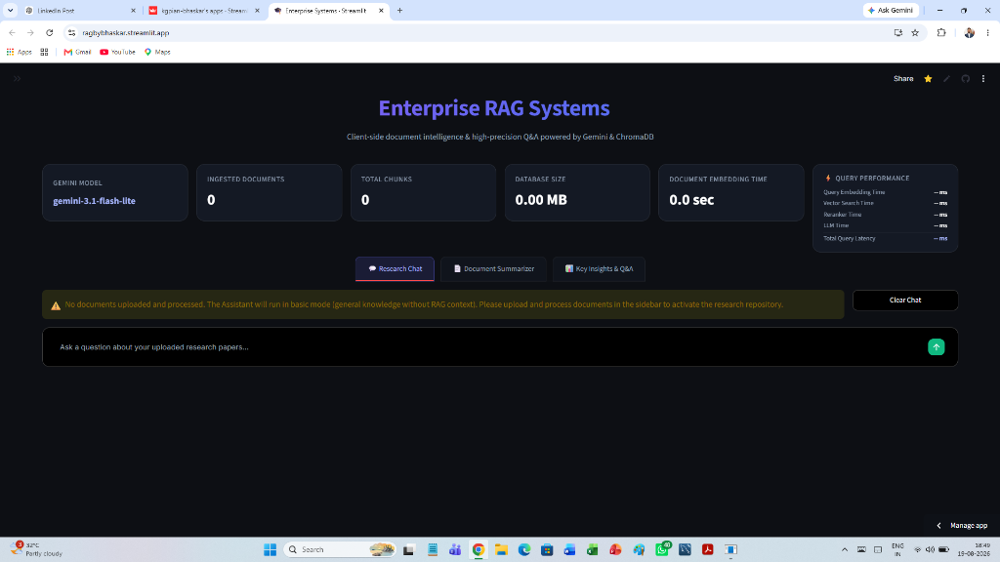
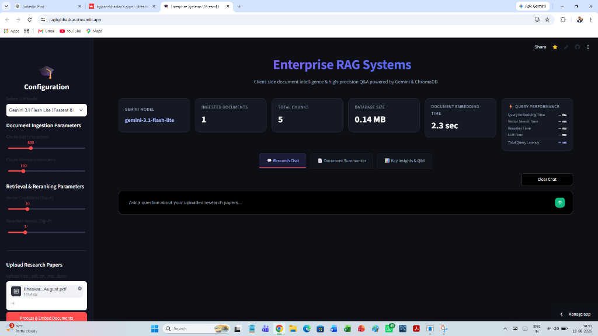
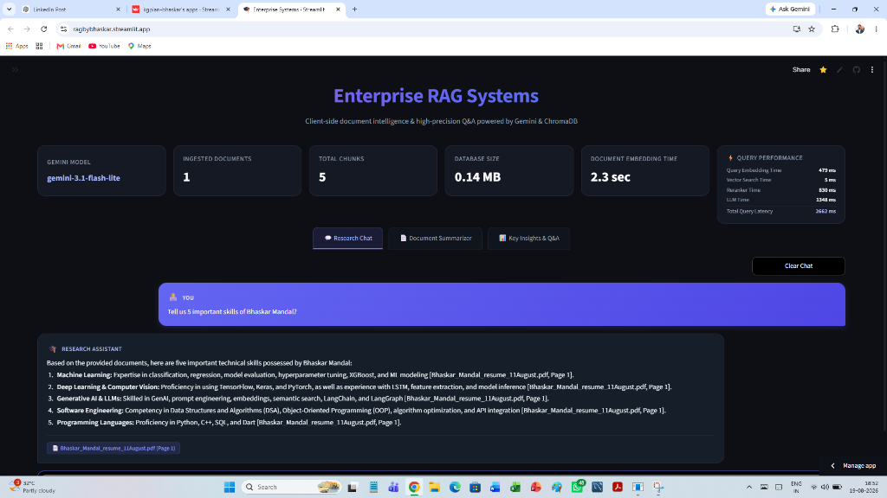

# Enterprise RAG Systems — Vector Search + Reranking

A high-performance, client-side **Retrieval-Augmented Generation (RAG)** system built with **Streamlit**, **Google Gemini API** (`gemini-embedding-2`, `gemini-2.0-flash`), **ChromaDB**, and a **BAAI CrossEncoder Reranker**. 

Designed for researchers and academic workflows, this application ingests documents (PDF, DOCX, TXT, MD), performs dense vector similarity retrieval, re-scores candidate chunks with deep cross-encoding, and streams grounded answers with verified document and page-level citations.

---

## 🔗 Live Demo

[](https://ragbybhaskar.streamlit.app/)

**Live URL:** [https://ragbybhaskar.streamlit.app/](https://ragbybhaskar.streamlit.app/)

---

## 📸 Application Screenshots

### 1. Dashboard Overview & Initial Metric Cards


### 2. Sidebar Configuration, Chunking Parameters & Ingestion Metadata


### 3. Grounded Q&A Chat, Document Citations & Real-Time Query Performance


---

## 🏗️ Architecture Pipeline

The following diagram details the complete current two-stage retrieval and generation architecture:


```mermaid
flowchart TD
    subgraph Ingestion["Document Ingestion Pipeline"]
        A[Documents .pdf, .docx, .txt, .md] --> B[Document Parsing & Text Extraction]
        B --> C[SimpleTextSplitter Chunking]
        C --> D[Gemini Embedding 2 API]
        D --> E[ChromaDB Ephemeral Store]
    end

    subgraph Query["Retrieval & Generation Pipeline"]
        F[User Question] --> G[Query Embedding]
        G --> H[ChromaDB Vector Similarity Search]
        H -->|Top-10 Candidate Chunks| I[CrossEncoder Reranker BAAI/bge-reranker-base]
        I -->|Top-3 Relevant Chunks| J[Prompt Construction]
        J --> K[Gemini LLM Generation]
        K --> L[Final Grounded Answer + Page Citations]
    end
```

---

## 💡 System Overview

The system addresses common limitations in naive LLM question answering (hallucinations, lack of domain context, lack of source citations) by embedding research papers into a searchable vector database and grounding LLM responses in retrieved text.

1. **Document Ingestion & Chunking**: Uploaded papers are parsed, split into overlapping text chunks, embedded using `gemini-embedding-2`, and indexed in ChromaDB.
2. **First-Stage Vector Search**: User queries are embedded and compared against stored vectors in ChromaDB to instantly select the **Top-10 candidate chunks**.
3. **Second-Stage Cross-Encoder Reranking**: Candidate chunks are re-evaluated alongside the query by `BAAI/bge-reranker-base` using joint self-attention to filter out false positives and select the **Top-3 most relevant chunks**.
4. **Grounded Answer Generation**: The Top-3 reranked chunks are passed into the system prompt for Gemini LLM (`gemini-2.0-flash`, `gemini-3.1-flash-lite`, etc.) to stream an academically structured answer with inline page citations.

---

## 🔍 Two-Stage Retrieval Pipeline

```
User Query ──► Vector Search (Top-10) ──► CrossEncoder Reranker (Top-3) ──► Gemini LLM ──► Grounded Answer
```

### First-Stage: Vector Similarity Search
- **Technology**: ChromaDB (Ephemeral Client) & `gemini-embedding-2`
- **Function**: Performs fast approximate nearest neighbor search across dense embeddings.
- **Output**: Retrieves **Top-10 candidate chunks** (`Top-K = 10`).

### Second-Stage: Cross-Encoder Reranking
- **Technology**: `BAAI/bge-reranker-base` (PyTorch CrossEncoder)
- **Function**: Computes deep query-document cross-attention to score true semantic alignment.
- **Output**: Filters duplicate candidates and extracts **Top-3 relevant chunks** (`Top-P = 3`).

---

## ⚙️ Current System Configuration

| Parameter | Configuration / Value | Description |
| :--- | :--- | :--- |
| **Embedding Model** | `gemini-embedding-2` | Google GenAI 3072-dim dense embeddings |
| **Vector Store** | ChromaDB (Ephemeral) | In-memory vector index with metadata tagging |
| **Vector Candidates (Top-K)** | `10` (Configurable 5–25) | First-stage candidate retrieval limit |
| **Reranker Model** | `BAAI/bge-reranker-base` | Deep CrossEncoder relevance scoring model |
| **Reranked Candidates (Top-P)** | `3` (Configurable 1–K) | Second-stage final context selection limit |
| **Default Chunk Size** | `800` characters | Text chunk boundary length |
| **Default Chunk Overlap** | `150` characters | Preserved context overlap between adjacent chunks |
| **LLM Model Options** | `gemini-2.0-flash` (Default)<br>`gemini-3.1-flash-lite`<br>`gemini-1.5-flash`<br>`gemini-1.5-pro` | Gemini models supported for response generation |

---

## 🛠️ Technology Stack

| Component | Technology | Role & Functionality |
| :--- | :--- | :--- |
| **Language** | Python 3.10+ | Core application runtime and RAG logic |
| **Frontend Framework** | Streamlit | Glassmorphism dashboard UI & interactive controls |
| **Embedding API** | `gemini-embedding-2` | Dense vector embedding generation for chunks & queries |
| **Vector Database** | ChromaDB | In-memory vector database and similarity search |
| **Reranker** | `sentence-transformers`<br>(`BAAI/bge-reranker-base`) | Second-stage cross-encoder relevance scoring |
| **LLM Generation** | Google GenAI SDK (`google-genai`) | Streaming response generation with grounded context |
| **Document Parsers** | `pdfplumber`, `pypdf`, `python-docx` | Extraction of text and page metadata from files |

---

## ⚡ Query Performance Instrumentation

The application embeds a real-time **⚡ Query Performance** monitoring card on the dashboard that tracks exact execution latencies for each stage using `time.perf_counter()`:

```text
⚡ Query Performance

Query Embedding Time     XX ms
Vector Search Time       XX ms
Reranker Time            XX ms
LLM Time                 XX ms
Total Query Latency      XX ms
```

**Latency Equation**:
$$\text{Total Query Latency} = \text{Query Embedding Time} + \text{Vector Search Time} + \text{Reranker Time} + \text{LLM Time}$$

---

## ✨ Key Features

- 📄 **Multi-Format Document Ingestion**: Upload research papers in `.pdf`, `.docx`, `.txt`, and `.md` formats.
- ✂️ **Configurable Chunking**: Real-time Streamlit sliders to adjust Chunk Size and Chunk Overlap.
- 🧠 **High-Dimensional Embeddings**: Dense 3072-dim representations via `gemini-embedding-2` with automatic 429 rate limit backoff.
- 🔎 **Fast Vector Similarity Search**: ChromaDB first-stage retrieval for Top-K candidate chunks.
- 🔄 **Cross-Encoder Reranking**: Re-scores Top-K candidates using `BAAI/bge-reranker-base` to eliminate irrelevant context.
- 🎓 **Grounded Answers with Page Citations**: Streaming responses with verified `📄 [Document, Page X]` source tags.
- ⚡ **Query Performance Metrics**: Live tracking of query embedding time, vector search time, reranker time, LLM generation time, and total query latency.
- 📊 **Repository Dashboards**: Live cards for Ingested Documents, Total Chunks, Database Size, and Document Embedding Time.
- 📄 **Executive Document Summarizer**: Auto-generates structured academic summaries for any uploaded paper.
- 📊 **Key Insights & Q&A Generator**: Extracts core concepts, claims, and discussion questions across the repository.

---

## 🤔 Why Reranking?

Vector search relies on bi-encoder embeddings (where query and document are embedded independently), allowing fast nearest-neighbor lookups across millions of vectors. However, bi-encoders can misrank candidate chunks due to missing fine-grained keyword interactions.

The CrossEncoder reranker processes the `Query ↔ Document` pair simultaneously through transformer attention layers, enabling deep semantic scoring.

```
Vector Search (Fast, Candidate Search) ──► Top-10 ──► Reranker (Deep, Fine-Grained) ──► Top-3 ──► LLM
```

### Trade-off Analysis
- ✅ **Pros**: Higher precision context selection, reduced LLM hallucinations, smaller prompt context size.
- ⚠️ **Trade-offs**: Adds minor inference latency (~300–800ms) during the reranking step.

---

## 📂 Repository Structure

```
.
├── assets/             # Application UI screenshots for documentation
│   ├── dashboard_overview.png
│   ├── ingestion_configuration.png
│   └── chat_and_performance.png
├── app.py              # Document extraction (PDF/DOCX/TXT/MD) & SimpleTextSplitter chunking
├── embedding.py        # GeminiEmbeddingFunction with retry & backoff for ChromaDB
├── vector_db.py        # VectorDBManager wrapping ChromaDB storage & similarity search
├── reranker.py         # CrossEncoder Reranker (BAAI/bge-reranker-base) for relevance scoring
├── streamlit_app.py    # Main Streamlit web application, UI dashboard & chat interface
├── requirements.txt    # Python dependencies
└── README.md           # Project documentation
```

---

## 💻 Installation & Local Setup

### 1. Prerequisites
- Python 3.10 or higher
- Google Gemini API Key ([Get API Key](https://aistudio.google.com/))

### 2. Clone & Install Dependencies

```bash
git clone https://github.com/KGPIAN-Bhaskar/RAG-Based-Research-Assistant.git
cd RAG-Based-Research-Assistant
pip install -r requirements.txt
```

### 3. Environment Setup

Create a `.env` file in the root directory:

```env
GEMINI_API_KEY=your_gemini_api_key_here
```

*Alternatively, configure `GEMINI_API_KEY` in `.streamlit/secrets.toml`.*

### 4. Run the Application

```bash
streamlit run streamlit_app.py
```

Open `http://localhost:8501` in your browser.

---

## ⚠️ Limitations

- **Rate Limits**: Heavy document ingestion relies on the Gemini API free/paid quotas. The embedding wrapper automatically retries on `429` rate limits.
- **Hardware Acceleration**: The CrossEncoder reranker runs on CPU by default if GPU is unavailable, adding slightly higher reranker latency (~400–900ms).
- **Exact Keyword Matching**: Pure semantic vector search may occasionally miss rare acronyms or exact serial numbers without lexical search.

---

## 🔮 Future Improvements (Next Steps)

1. **Hybrid Retrieval (Lexical + Vector)**:
   - Combine **BM25 Keyword Search** with **Vector Similarity Search** using Reciprocal Rank Fusion (RRF) prior to reranking.
2. **Persistent Vector Database**:
   - Migrate ChromaDB from an ephemeral in-memory client to disk or cloud persistence (Chroma Server / Pinecone / Qdrant).
3. **Multi-Modal Document Parsing**:
   - Incorporate OCR and image-based PDF table extraction (Unstructured / LlamaParse).
